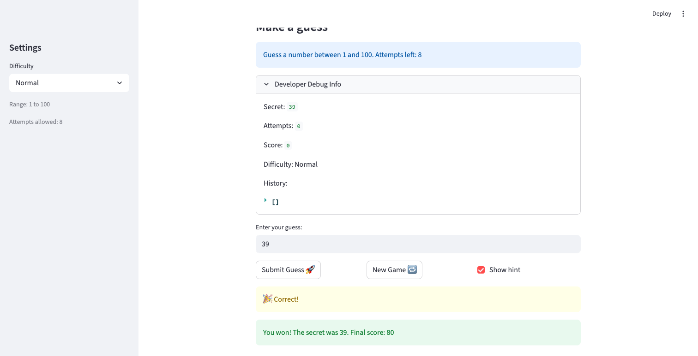

# 🎮 Game Glitch Investigator: The Impossible Guesser

## 🚨 The Situation

You asked an AI to build a simple "Number Guessing Game" using Streamlit.
It wrote the code, ran away, and now the game is unplayable. 

- You can't win.
- The hints lie to you.
- The secret number seems to have commitment issues.

## 🛠️ Setup

1. Install dependencies: `pip install -r requirements.txt`
2. Run the broken app: `python -m streamlit run app.py`

## 🕵️‍♂️ Your Mission

1. **Play the game.** Open the "Developer Debug Info" tab in the app to see the secret number. Try to win.
2. **Find the State Bug.** Why does the secret number change every time you click "Submit"? Ask ChatGPT: *"How do I keep a variable from resetting in Streamlit when I click a button?"*
3. **Fix the Logic.** The hints ("Higher/Lower") are wrong. Fix them.
4. **Refactor & Test.** - Move the logic into `logic_utils.py`.
   - Run `pytest` in your terminal.
   - Keep fixing until all tests pass!

## 📝 Document Your Experience

**Game purpose:** A number guessing game where the player picks a difficulty, then tries to guess a secret number within a limited number of attempts. Hints guide the player higher or lower after each guess, and a score tracks performance across attempts.

**Bugs found:**
1. Attempts counter initialized to 1 instead of 0, showing one attempt used before any guess was made.
2. Hint messages were reversed — guessing too high said "Go HIGHER!" and guessing too low said "Go LOWER!".
3. On even-numbered attempts the secret was cast to a string, causing alphabetical comparison instead of numeric (e.g. 9 appeared greater than 38).
4. Clicking "New Game" never reset the game status, so the game stayed locked in a won/lost state and blocked further play.
5. Hard difficulty used the range 1–50 while Normal used 1–100, making Hard paradoxically easier.
6. The on-screen range prompt was hardcoded to "1 to 100" regardless of the selected difficulty.
7. Wrong guesses on even-numbered attempts added 5 points to the score instead of subtracting them.
8. "New Game" always picked the secret from 1–100 regardless of the selected difficulty range.

**Fixes applied:**
- Initialized `attempts` to `0` in session state.
- Swapped the "Go HIGHER!" and "Go LOWER!" return strings in `check_guess`.
- Removed the even/odd attempt branch that cast the secret to a string — the secret is always compared as an int.
- Added `st.session_state.status = "playing"` (and score/history resets) to the New Game handler.
- Changed Hard difficulty range from 1–50 to 1–200.
- Updated the info prompt to use `{low}` and `{high}` from `get_range_for_difficulty`.
- Removed the `+5` branch in `update_score` so all wrong guesses consistently subtract 5.
- Changed the New Game secret to `random.randint(low, high)` using the current difficulty range.
- Refactored all pure logic (`check_guess`, `parse_guess`, `update_score`, `get_range_for_difficulty`) into `logic_utils.py`.

## 📸 Demo

### 🏆 Winning game

### ✅ pytest — 15 passed (Challenge 1: Advanced Edge-Case Testing)

## 🚀 Stretch Features

- [ ] [If you choose to complete Challenge 4, insert a screenshot of your Enhanced Game UI here]
